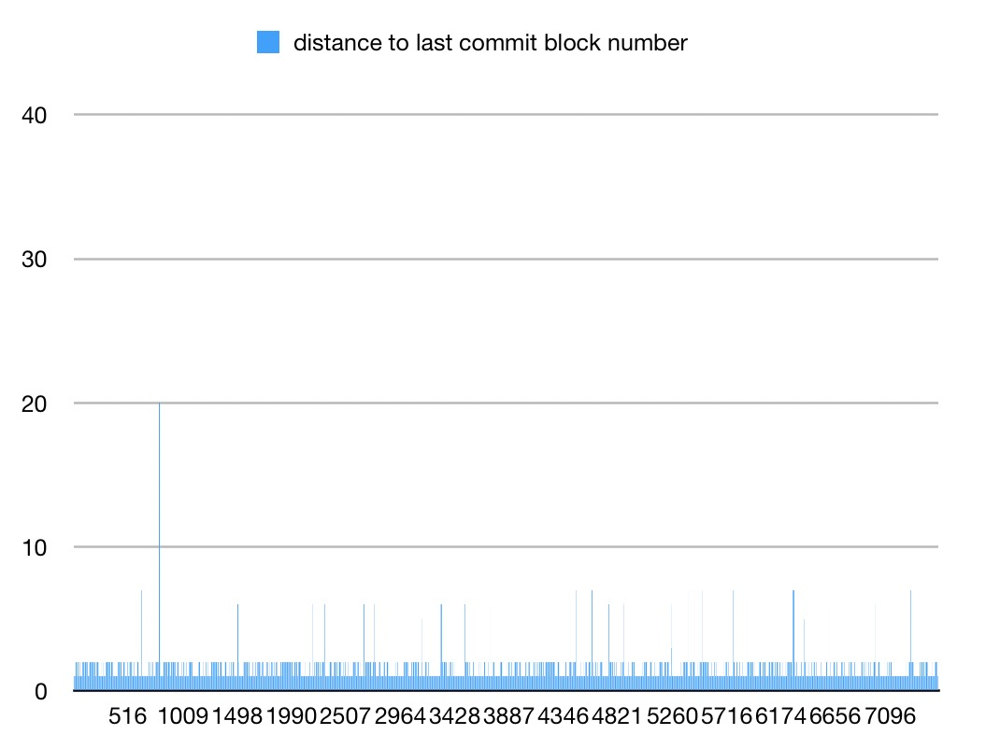
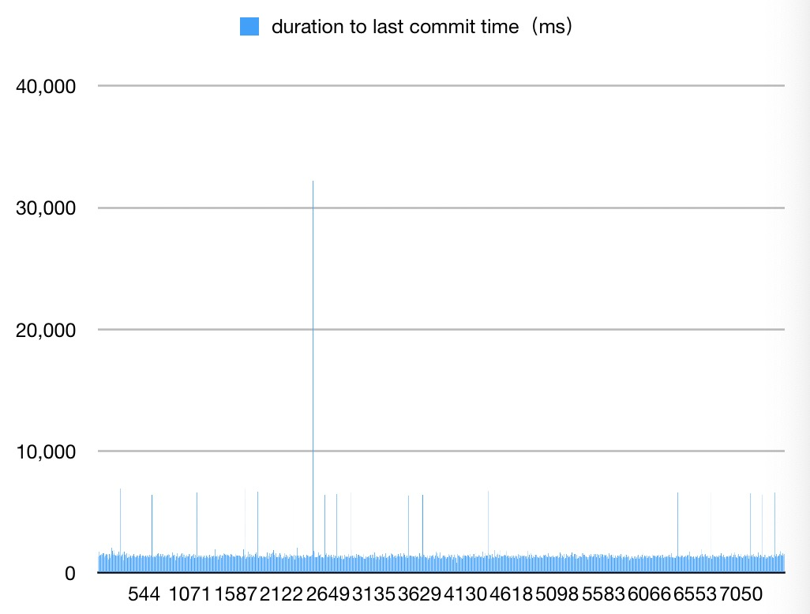

# Contentos technical white paper

Contentos is a blockchain system that aims to form the foundation for a decentralized digital content ecosystem. It provides mature security mechanism to protect users’ accounts, and is flexible enough to meet various operational needs. The economic rules incentivize users to contribute valuable contents and participate in activities in the system. Its consensus protocol is a combination of DPoS and BFT to achieve high throughput and fast confirmation of transactions.

Contentos also provides gPRC and RESTful API services, supports HTTP, HTTPS access. Smart contract is also supported, which enables users to develop their own dAPPs. To make it more user friendly, Contentos provides plenty of smart contract APIs that supports on-chain data query, asset transfer, contents management and cross-contract invocation. A smart contract template module is also provided to make it easier to develop and deploy smart contract.

## 1.Consensus

### 1.1 overview
According to CAP theory: a distributed system cannot have consistency, availability and partition tolerance at the same. A new consensus protocol called saBFT is invented to achieve consistency and availability,  maximize the system’s throughput and minimize the confirmation time of transactions. It generates blocks in the same manner of DPoS and adopts bft to achieve fast block confirmation. It's self adaptive in a way that it can adjust the frequency of bft process based on the load of the blockchain and network traffic.

### 1.2 terminology
node: a server running contentos daemon(cosd)
block producer: a node that generate blocks
validator: a node that participates in bft consensus
proposer: a validator who broadcasts a proposal
proposal: a block on which all validators try to reach consensus, once reached, it'll be committed
commit: commit a block means mark the block as the last irreversible block

### 1.3 Block generation
SABFT generates blocks in the same manner of DPoS. Each validator takes turn to produce 10 blocks in a row and a block is generated every second. Fork is possible, the longest chain is considered as the current main branch.

### 1.4 Fork switch
If another branch out grows the main branch, swichFork is taken place.It finds the common ancestor of the two branches, pop all blocks on the main branch after the ancestor and apply blocks on the longer branch

### 1.5 why we need BFT
Instant transactions are required in many scenarios, especially when it involves asset transfer. In bitcoin world, there is no guarantee to finalize a certain block because theoretically any node with enough resource can generate a longer chain and cause a fork switch. This is a direct violation of safety in the realm of distributed system. Hence we adopt BFT to achieve fast consensus. Once a consensus is reached on a certain block, it can never be reverted.

### 1.6 Performance
SABFT reaches consensus in 1~2 seconds in LAN. The bft process adopts 3-phase-commit(propose, prevote, precommit), in the propose phase, validators wait synchronously for the proposer to broadcast proposal, the rest two phases are completely asynchronous.
To better illustrate SABFT's performance, a experiment is conducted with following limitations:

**test environment**

| hardware     | parameter        |
| -------- | ----------- |
| CPU | 2 CPU |
| RAM | 8 GB |
| bandwidth     | 100 GB/s    |

**limitations**

| type               | parameter     |
| ------------------ | -------- |
| NO. of consensus nodes           | 19       |
| max bandwidth between two nodes | 100 KB/s |
| block size           | 50 KB    |
| NO. of blocks monitored     | 7000+    |

The figure below shows the margin step of 7000 blocks. The average is 1.49. 

The figure below shows the interval between two committed blocks. The average is 1500ms. 

The figure below shows the interval between a block's generation time and its commit time. In average, it takes 1800ms for a block to be committed and this includes the block's generation time. 

### 1.7 how it's different
SABFT's block producing process and bft process are completely decoupled. i.e. validator can generate blocks despite the state of the bft process. Let's say the current block height is 100 and the bft process only committed the block with height of 90, validator can start generating the 101's block without waiting for block 91-100 to be committed.
Another significant difference is that the bft process does't have to reach consensus on every block. The height difference of two consecutive blocks that reached consensus is called margin step. It is adjusted by SABFT automatically according to the network condition and load of the Contentos chain. SABFT can usually reach consensus every 1 or 2 seconds, the margin step increases due to heavier load, network traffic or the presence of byzantine nodes.

### 1.8 behaviour
propose:
how to choose a proposer: a new proposer is chosen among all validators in every bft voting round in round-robin
how to pick a proposal: proposer simply propose its head block

commit:
         it's possible that a block that is about to be committed is not on the main branch, hence a fork switch is needed.

### 1.9 self adaptation explained
In the case of network jam, validators crash or byzantine validators, block confirmation can be delayed. The self adaptive mechanism makes sure that the system can quickly confirm the latest generated block in later rounds.
A new proposer is chosen among all validators in every bft voting round in round-robin. The proposer simply proposes the latest block it knows, when it’s confirmed, all the blocks before it will be confirmed too. In the case of network latency, other validators may not receive the proposed block or its votes. If validators always propose the latest block, bft consensus may not be reached in a very long time. To overcome this, block with smaller block number than the head block is proposed if consensus is not reached in several voting rounds.
The bft process can be considered a state machine. The state consists of height, round and step. Step is omitted here to simplify the process. In each height, one or more rounds exist. Round starts from 0 in each height and increases if bft consensus is not reached in this round. H1R0 indicates the current state is at height of 1 and round of 0.
The following picture illustrates how SABFT adjusts its bft process if any of the abnormal situations we mentioned earlier occurs.

At t1 block 1 is generated, meanwhile the bft process starts and the proposer proposed block 1. Soon at t1’(t1<t1’<t2), consensus is reached and block 1 is committed. At t2, block 2 is generated and it’s proposed. However things get messy and no consensus is reached in round 0 before timeout. At t4 the state enters H2R1 and block 4 is proposed. Finally at t2’ consensus is reached on block 4 and block 2-4 is committed at once. From t6 things go back to normal and all blocks after block 5 are committed within 1 second. As is shown above the margin step in height 2 is 4, after that it quickly drops to 1.

### 1.10 worst case scenario
According to FLP impossibility, in a asynchronous network, there's no deterministic way to achieve consensus with one faulty process. In each round of the bft process, there always exists a critical failure like crash, network jam or malicious nodes broadcast bad message which mess up the vote process. Theoretically there's a situation where every single bft round ends up with failure but the possibility decrease exponentially as round grows. It's a bit too paranoid to worry about this.
Bottom line, there is no perfect way to guarantee both safety and liveness. We take safety as our priority, the only thing need to be worried about is that too many uncommitted blocks might eventually eat up the memory resource. But we can easily come up with a retention policy to discard far out blocks, which is out of the scope of this discussion.

### 1.11 bad behaviour punishment
Technically abnormal behaviour can be hold accountable as long as we track enough information. Here's some first thought:
* validators that are offline or constantly absent from block producing or bft voting should be removed from validator set
* validators that has following behaviour should be punished:
>generates conflicting blocks
>signs conflicting votes
>violates the POL voting rule
>constantly proposes invalid blocks

## 2. Parallel processing
To maximize the TPS of the system, a parallel processing architecture is introduced. 

Data in the system is generalized as a combination of property. A property is the minimum representation unit of data. Property is considered independent to each other and different properties can be processed in parallel.

An transaction can be processed in 4 stages: decoding,  reading, execution and writing. Decoding stage generates a evaluating function along with its dependent input and output properties. Reading stage reads input properties from database. Execution stage feeds evaluating function with input properties and gets values of output properties. Writing stage writes updated output properties to database. We can establish a 4-stage parallel pipeline in which database I/O occurs in reading and writing stage only. When I/O blocks, decoding and execution can still make full use of CPU resource.

## 3. Economic system
The general representation of asset in Contentos is called COS, which can be transferred among accounts. Holding COS doesn’t give users voting power. To get more voting power, users can stake their COS and transfer COS to VESTS, which cannot be participate in the monetary circulation process in the system. A user with more VESTS has more influence in the system. The COS to VESTS ratio is always 1:1. 

Each time a block is generated, newly generated VESTS will be partially put into the reward pool. The rest will be assigned to the block producer as reward. The amount of VEST generated in each block is decided by a mathematic model, which can be adjusted by all the members in the committee.  Block producers get 15% of the VESTS while dAPP related users get 10%.

10% of the VESTS in reward pool will be given to dAPP developers. Content creators get 56.25% and commenters get 11.25%. 

The reward of content creator and commenter relies on the following factors:
>reward pool：Generating a block cause inflation. The COS minted during this process will be put into reward pool
vote_power：A user’s vote_power indicates how much the user’s vote matters to a post’s reward. If a user with higher vote_power upvotes a post, the creator of the post will get more reward. A user’s vote_power will decrease by 3.33% each time the user upvotes a post and will increase as time passes by. vote_power = ( vest^k ) * 30 *(credit_score^m) . k and m are parameters, which are adjusted by block producers.
post_power : how much vote_power a post has accumulated
total_vote_power：increase when a user upvotes a post, decrease when a block is generated.

All posts and comments uploaded exactly 7 days ago will be rewarded. Each post’s reward is: x * post_power /  total_vote_power, where x is the total COS in reward pool. The reward will be added to the total_vote_power, which will decrease about 1 / (86400 * 17) every time a new block is generated.

Transfer from COS to VESTS is called power up and power down vice versa. Power up is instant while power down takes about 13 weeks to complete. Multiple power down inside an account at the same time is not allow.

## 4. Reputation

A reputation system is introduced to regulate users' behaviour. If economic rule is to be the only restraint and incentive, some users will produce as many contents of poor quality as possible to get reward. The reputation system works as follows:

1. Each account's reputation value is set to 100 as default when it's created
2. All block producers elects a single reputation administrator who has the authority to manage other users' reputation value
3. If administrator finds an user has any malicious deeds, set the user's reputation value to 0
4. An user with 0 reputation value cannot get any reward

## 5. Copyright
A copyright system is introduced to prevent infringement acts：

1. All block producers elects a single copyright administrator
2. If a user carries out infringement acts, say the user plagiarizes other people's contents, the administrator will mark the post so that it gets no rewards.

## 6. Resource consumption

### 6.1 resource type

Network resource: Broadcasting a transaction consumes network resources, which is calculated by the size of the transaction.

CPU resource: When an action in smart contract is invoked, CPU resource is consumed.

### 6.2 fee
To simplify the fee calculation of network and CPU resource consumption, the above resource type is converted to stamina.

If user’s stamina is insufficient for network resource consumption of the transaction he/she sent, the transaction will be discarded without deducting stamina.

If the transaction is invalid, stamina will be deducted.

If stamina is insufficient for the CPU resource consumption, the transaction will not be executed. However the rest of the user’s stamina is costed.

### 6.3 how to get stamina
Free stamina: each user has a certain amount of stamina that will be regenerated daily.
Stake COS: if a user needs more stamina, he/she can stake COS to get more VEST. The more VEST a user has, the more extra stamina the user gets. Specifically, the usage and regeneration of stamina in Contentos is calculated using Exponential Weighted Moving Average

Exponential Weighted Moving Average:
At time $t$，the moving average： $V_t=\beta V_{t-1}+(1-\beta)\theta_{t}$   $t=1,2,3,...n$  ， $V_t$ is the potential moving average at time $t$ .  $\theta_{t}$ is the actual value at time $t$ . $\beta$ is the weight.

## 7. Account system
### 7.1 account name
Account name is the unique identification of an account in Contentos. It contains 6~16 characters, each character has to be a lower case letter or a digit number.
### 7.2
Contentos uses digital signature to check authority. Each user has a pair of pub/priv key. Users must sign their messages with their private key and the receivers use public key to verify the authenticities of the messages.

## 8. Storage service
Contentos uses LevelDB to store data. The performance is as follows:
##### initial dataset = 100,000

|        | leveldb/key: int64 | leveldb/key: string16 |
| ------ | ------------------ | --------------------- |
| INSERT | 190,985            | 193,573               |
| QUERY  | 36,627             | 39,842                |
| UPDATE | 32,107             | 29,975                |
| DELETE | 228,10             | 223,41                |

##### initial dataset = 1,000,000

|        | leveldb/key: int64 | leveldb/key: string16 |
| ------ | ------------------ | --------------------- |
| INSERT | 189,322            | 174,581               |
| QUERY  | 33,231             | 34,575                |
| UPDATE | 29,455             | 28,918                |
| DELETE | 254,647            | 198,649               |

##### initial dataset = 10,000,000

|        | leveldb/key: int64 | leveldb/key: string16 |
| ------ | ------------------ | --------------------- |
| INSERT | 174,794            | 165,809               |
| QUERY  | 23,347             | 12,996                |
| UPDATE | 22,795             | 17,041                |
| DELETE | 248,015            | 237,812               |

> more details：[db_benchmark](https://github.com/coschain/db_benchmark)

A high-performance, highly available database service is implemented based on LevelDB and mem cache. It provides transactional supports and fast roll back mechanism.

## 9.Smart contract and virtual machine
The smart contracts in Contentos currently can only be written in C/C++ language. WebAssembly is the virtual machine on which these smart contracts run.
### 9.1 supported actions
Smart contracts developed by users will be compiled into WASM byte codes which can be deployed on the blockchain. A series of APIs are provided to make the contract development eaiser. It provides similar features to ERC20 standards. Also the APIs allows the contract developers to post an article, comment or get statistics they care about. Smart contracts can be updated online so that developer can hotfix bugs or add new features.
### 9.2 limitations
The running time of a contract together with the CPU, RAM, bandwidth resources it can use is limited to maintain the stableness of the system.
### 9.3 security
Smart contracts are running in a sandbox called webassembly. The security model of WebAssembly has two important goals: (1) protect users from buggy or malicious modules, and (2) provide developers with useful primitives and mitigations for developing safe applications, within the constraints of (1). Meanwhile, Contentos will also conduct a authority validation and resource check before and during the execution of a smart contract.

## 10. Smart contract API
Contentos provides plenty of APIs to enable dAPP developer to write contracts with advanced features, which include but not limited to:
* any low-level operations like read/write from/to blockchian
* high-level operations like post articles or comment
* cross-contracts interactions

## 11. Smart contract template
To make smart contract development and deployment much easier, a new feature call smart contract template is provided in Contentos. Users can propose a template, once adopted, other users with no programming skills can also develop and develop their own contracts using the template.

## 12. Plugin
A plugin mechanism is implemented in Contentos so that users can develop their own plugin to add new functionalities. Currently, `TrxSqlService , StateLogService , DailyStatService ` are provided for statistics purposes.

